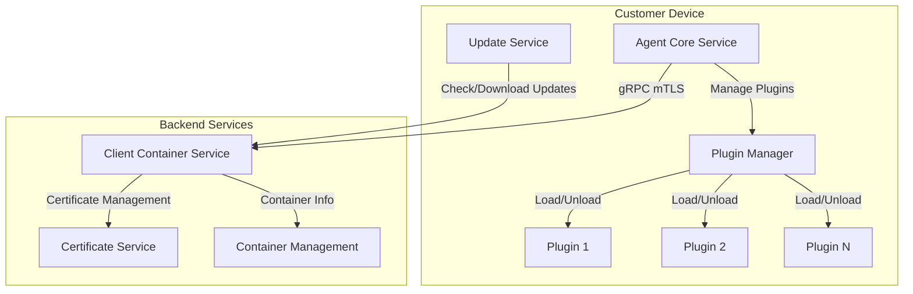

# Cross-Pl

atform Agent Program Architecture Plan

## Overview

The Agent Program will be a Go-based, cross-platform application that manages customer devices and integrates with the existing Client Container system. It consists of two separate services that run independently but coordinate through well-defined interfaces.

## Architecture Diagram




## Directory Structure

```javascript
agent/
├── cmd/
│   ├── update-service/          # Update Service binary
│   │   └── main.go
│   └── agent-core/               # Agent Core Service binary
│       └── main.go
├── internal/
│   ├── update/                   # Update Service implementation
│   │   ├── service.go
│   │   ├── downloader.go
│   │   ├── verifier.go
│   │   ├── installer.go
│   │   └── rollback.go
│   ├── core/                     # Agent Core Service implementation
│   │   ├── service.go
│   │   ├── device_registry.go
│   │   ├── plugin_manager.go
│   │   ├── health_monitor.go
│   │   └── config_manager.go
│   ├── plugin/                   # Plugin system
│   │   ├── interface.go
│   │   ├── loader.go
│   │   ├── registry.go
│   │   └── lifecycle.go
│   ├── communication/            # gRPC client and communication
│   │   ├── grpc_client.go
│   │   ├── mtls_config.go
│   │   └── reconnect.go
│   ├── security/                 # Security utilities
│   │   ├── credential_store.go
│   │   ├── certificate_manager.go
│   │   └── encryption.go
│   ├── platform/                 # Platform-specific implementations
│   │   ├── windows/
│   │   │   ├── service.go
│   │   │   └── file_locks.go
│   │   ├── linux/
│   │   │   ├── service.go
│   │   │   └── systemd.go
│   │   └── darwin/
│   │       ├── service.go
│   │       └── launchd.go
│   └── utils/                    # Shared utilities
│       ├── logger.go
│       ├── device_info.go
│       └── version.go
├── proto/                        # gRPC protocol definitions
│   └── agent.proto
├── config/                       # Configuration files
│   ├── config.go
│   └── defaults.go
├── build/                        # Build scripts
│   ├── build.sh
│   ├── build.ps1
│   └── Dockerfile
└── README.md
```


## Component Details

### 1. Update Service

**Purpose**: Handles all agent update operations independently from the core service.**Key Responsibilities**:

- Periodically check for available updates from backend API
- Download update packages with integrity verification
- Verify update signatures using public key from backend
- Install updates atomically (copy to staging, verify, swap)
- Maintain rollback capability (keep previous version)
- Report update status to backend

**Implementation Files**:

- `agent/internal/update/service.go` - Main update service orchestration
- `agent/internal/update/downloader.go` - Download with resume support
- `agent/internal/update/verifier.go` - Signature verification (Ed25519/ECDSA)
- `agent/internal/update/installer.go` - Atomic installation process
- `agent/internal/update/rollback.go` - Rollback mechanism

**Key Features**:

- Atomic updates: Download to temp, verify, then swap executables
- Rollback: Keep N previous versions, auto-rollback on failure
- Signature verification: Ed25519 signatures verified against backend public key
- Update manifest: JSON file with version, checksums, signatures
- Self-update: Update Service can update itself and Agent Core

### 2. Agent Core Service

**Purpose**: Main agent functionality for device management and plugin orchestration.**Key Responsibilities**:

- Device registration with Client Container
- Plugin lifecycle management (install, activate, deactivate, remove)
- Health monitoring and reporting
- Configuration management
- Secure communication with backend via gRPC

**Implementation Files**:

- `agent/internal/core/service.go` - Main service orchestration
- `agent/internal/core/device_registry.go` - Device registration and info collection
- `agent/internal/core/plugin_manager.go` - Plugin management
- `agent/internal/core/health_monitor.go` - Health checks and reporting
- `agent/internal/core/config_manager.go` - Configuration persistence

**Key Features**:

- Device fingerprinting: OS, hardware IDs, serial numbers
- Plugin isolation: Each plugin runs in separate goroutine with error boundaries
- Health reporting: Periodic health status to backend
- Configuration sync: Pull configuration from backend, merge with local

### 3. Plugin System

**Purpose**: Extensible architecture for service add-ons.**Plugin Interface**:

```go
type Plugin interface {
    Name() string
    Version() string
    Initialize(config map[string]interface{}) error
    Start() error
    Stop() error
    HealthCheck() (bool, error)
    GetStatus() map[string]interface{}
}
```

**Implementation Files**:

- `agent/internal/plugin/interface.go` - Plugin interface definition
- `agent/internal/plugin/loader.go` - Dynamic plugin loading (Go plugins or separate binaries)
- `agent/internal/plugin/registry.go` - Plugin registry and lifecycle
- `agent/internal/plugin/lifecycle.go` - Start/stop/restart management

**Plugin Distribution**:

- Plugins downloaded from backend API endpoint: `/api/v1/plugins/{name}/download`
- Plugin manifest includes: name, version, checksum, signature, dependencies
- Plugins stored in: `{agent_data_dir}/plugins/{name}/{version}/`

### 4. Communication Layer

**Purpose**: Secure gRPC communication with Client Container.**Implementation Files**:

- `agent/internal/communication/grpc_client.go` - gRPC client with connection pooling
- `agent/internal/communication/mtls_config.go` - mTLS certificate loading and configuration
- `agent/internal/communication/reconnect.go` - Automatic reconnection with exponential backoff

**gRPC Service Definition** (to be added to `services/client-container/proto/agent.proto`):

```protobuf
service AgentService {
    rpc RegisterDevice(RegisterDeviceRequest) returns (RegisterDeviceResponse);
    rpc VerifyDevice(VerifyDeviceRequest) returns (VerifyDeviceResponse);
    rpc ReportHealth(HealthReport) returns (HealthResponse);
    rpc GetConfiguration(ConfigRequest) returns (ConfigResponse);
    rpc ListPlugins(PluginListRequest) returns (PluginListResponse);
    rpc InstallPlugin(InstallPluginRequest) returns (InstallPluginResponse);
    rpc UninstallPlugin(UninstallPluginRequest) returns (UninstallPluginResponse);
    rpc ActivatePlugin(ActivatePluginRequest) returns (ActivatePluginResponse);
    rpc DeactivatePlugin(DeactivatePluginRequest) returns (DeactivatePluginResponse);
}
```


### 5. Security & Isolation

**Credential Storage**:

- Windows: Windows Credential Manager or encrypted file in `%APPDATA%`
- Linux: Encrypted file in `~/.config/agent/` with 600 permissions
- macOS: Keychain or encrypted file in `~/Library/Application Support/agent/`

**Client Isolation**:

- Device certificate contains container_id in CN or SAN
- Agent validates it can only communicate with its assigned container
- Configuration file locked to container_id (prevents switching)

**Implementation Files**:

- `agent/internal/security/credential_store.go` - Platform-specific credential storage
- `agent/internal/security/certificate_manager.go` - Certificate loading and validation
- `agent/internal/security/encryption.go` - Encryption utilities for local storage

### 6. Platform-Specific Services

**Service Installation**:

- Windows: Install as Windows Service using `golang.org/x/sys/windows/svc`
- Linux: Systemd unit file for both services
- macOS: LaunchAgent plist files

**Implementation Files**:

- `agent/internal/platform/windows/service.go` - Windows service wrapper
- `agent/internal/platform/linux/service.go` - Systemd integration
- `agent/internal/platform/darwin/service.go` - LaunchAgent integration

## Backend Integration Points

### Client Container Service Updates

**New gRPC Endpoints** (add to `services/client-container/proto/agent.proto`):

- Device registration and verification
- Health reporting
- Plugin management
- Configuration distribution
- Update manifest distribution

**New REST Endpoints** (add to `services/client-container/cmd/server/main.go`):

- `GET /api/v1/agents/updates/check` - Check for agent updates
- `GET /api/v1/agents/updates/download/{version}` - Download update package
- `GET /api/v1/plugins/{name}/download` - Download plugin package
- `GET /api/v1/plugins/{name}/manifest` - Get plugin manifest

**Database Schema Updates**:

- Add `agent_versions` table to track agent versions and update manifests
- Add `plugin_registry` table to track available plugins
- Extend `devices` table with `agent_version`, `last_health_report`, `health_status`

### Update Distribution

**Update Package Structure**:

```javascript
update-{version}.tar.gz
├── manifest.json          # Version, checksums, signatures
├── update-service         # Update Service binary
├── agent-core            # Agent Core binary
├── update-service.sig    # Ed25519 signature
└── agent-core.sig        # Ed25519 signature
```

**Update API Endpoints**:

- `GET /api/v1/agents/updates/latest?os={os}&arch={arch}` - Get latest version info
- `GET /api/v1/agents/updates/manifest/{version}` - Get update manifest
- `GET /api/v1/agents/updates/download/{version}` - Download update package

## Implementation Phases

### Phase 1: Foundation

1. Create agent directory structure
2. Implement basic configuration management
3. Implement platform detection and device info collection
4. Set up gRPC proto definitions
5. Implement mTLS client configuration

### Phase 2: Update Service

1. Implement update checking and downloading
2. Implement signature verification
3. Implement atomic installation
4. Implement rollback mechanism
5. Add update service as platform service

### Phase 3: Agent Core - Device Registration

1. Implement device registration flow
2. Implement certificate management
3. Implement credential storage
4. Add client isolation validation

### Phase 4: Agent Core - Plugin System

1. Define plugin interface
2. Implement plugin loader
3. Implement plugin registry and lifecycle
4. Implement plugin download and installation

### Phase 5: Communication & Health

1. Implement gRPC client with reconnection
2. Implement health monitoring
3. Implement periodic health reporting
4. Implement configuration sync

### Phase 6: Backend Integration

1. Add gRPC service to client-container
2. Add update distribution endpoints
3. Add plugin distribution endpoints
4. Update database schema
5. Add agent version tracking

### Phase 7: Platform Services & Build

1. Implement Windows service wrapper
2. Implement Linux systemd integration
3. Implement macOS LaunchAgent integration
4. Create cross-platform build scripts
5. Add installation/uninstallation scripts

## Security Considerations

1. **Certificate Pinning**: Agent validates backend certificate against stored CA
2. **Update Signing**: All updates signed with Ed25519, verified before installation
3. **Plugin Sandboxing**: Plugins run with limited permissions, isolated from core
4. **Credential Encryption**: All stored credentials encrypted with platform keychain/DPAPI
5. **Client Isolation**: Device certificate enforces container binding, cannot be changed

## Testing Strategy

1. **Unit Tests**: Each component tested independently
2. **Integration Tests**: Test agent-backend communication
3. **Platform Tests**: Test on Windows, Linux, macOS VMs
4. **Update Tests**: Test update flow, rollback, failure scenarios
5. **Plugin Tests**: Test plugin loading, lifecycle, error handling

## Dependencies

- `google.golang.org/grpc` - gRPC client